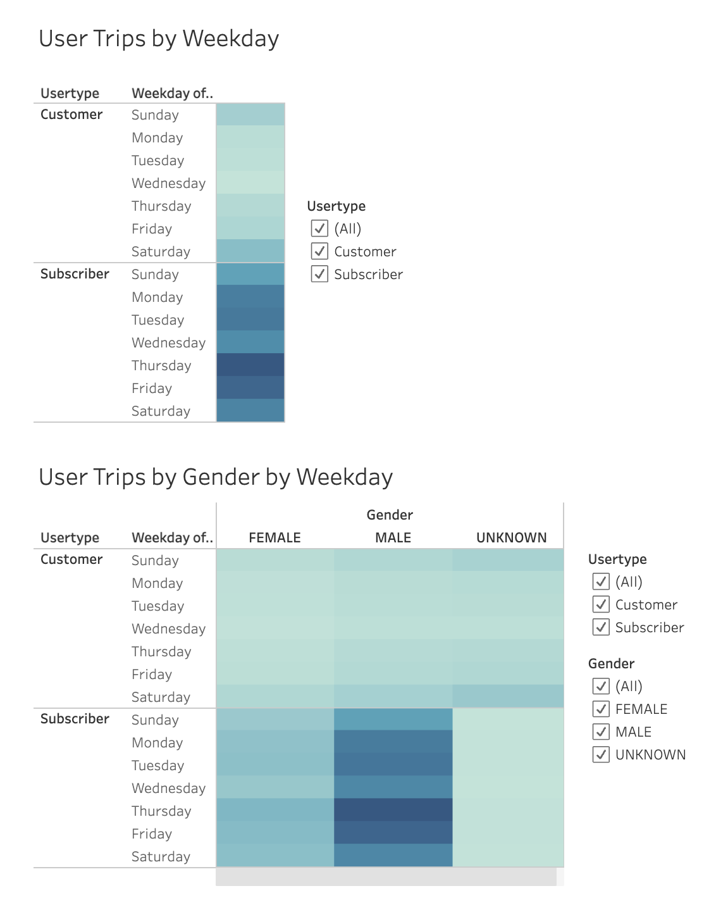

# Citi Bike Usage (August 2019)

## Overview of Project

### Purpose

The purpose of this project was to use Tableau Public to visualize data from Citi Bike's bikesharing statistics from August 2019 and to provide summary statistics.

### Data

The data used comes from Citi Bike's public datasets, specifically `201908-citibike-tripdata.csv.zip`. That file can be found **[HERE](https://s3.amazonaws.com/tripdata/index.html)**.

## Results

### Tableau Visualization

All of the proceeding screenshots are taken from my Tableau Public visualization. All of that data, and more, can be viewed and interacted with in my [August 2019 Citi Bike Story](https://public.tableau.com/app/profile/michael.marchand2858/viz/CitibikeAugust2019_16790902829250/August2019CitiBikeStory) story.

### Customer Types

Grouping the users into 2 different categories of `Customer Type` and `Gender` shows:
- **Subscribers** are the largest group of users by `Customer Type`
- **Males** are the largest group of users by `Gender`  

### Popular Citi Bike Station Locations

This map shows all the starting locations of bike trips, with the bubble size representing the amount.  

This map shows all the ending locations of bike trips, with the bubble size representing the amount.  

### Length of Trips

This chart shows that 5 minutes was the single most common length of bike trip duration.  

This chart breaks down the trip duration into each gender.  
### Popular Times of Usage

This heatmap shows at what hour in each day of the week sees the most usage.  

This heatmap shows at what hour in each day of the week sees the most usage by females.  

This heatmap shows at what hour in each day of the week sees the most usage by males.  

- The first heatmap shows what days in a week see the most usage, and is grouped by `Customer Type`.
- The second heatmap shows what days in a week see the most usage, and is grouped by `Customer Type` and `Gender`  

## Summary

### Brief Analysis

- August 2019 saw 2,344,224 trips completed
- Subscribers are the majority customer type
- Males are the majority Gender Type
- The majority of customers are using the bikes for under 30 minute trips
- All days from 2:00am to 5:00am see the least amount of trips being taken with Citi Bikes
- Thursday between 5:00pm and 7:00pm see the most usage for the bikes
- Thursdays and Fridays are the days with the most usage in general

### Additional Visualizations

This visualization breaks down the usage of each gender by birth year. The default birth year for a customer is `1969`. For this reason, the year `1969` cannot be considered an accurate data point.  

This one was fun. I wanted to see if there were any repeat combinations of `Starting Station` to `Ending Station` pairings. I was surprised to find there were actually quite a few. This visualization is also very beautiful. If you haven't checked out the Tableau Public story yet, this slide is fun and interactive.  
